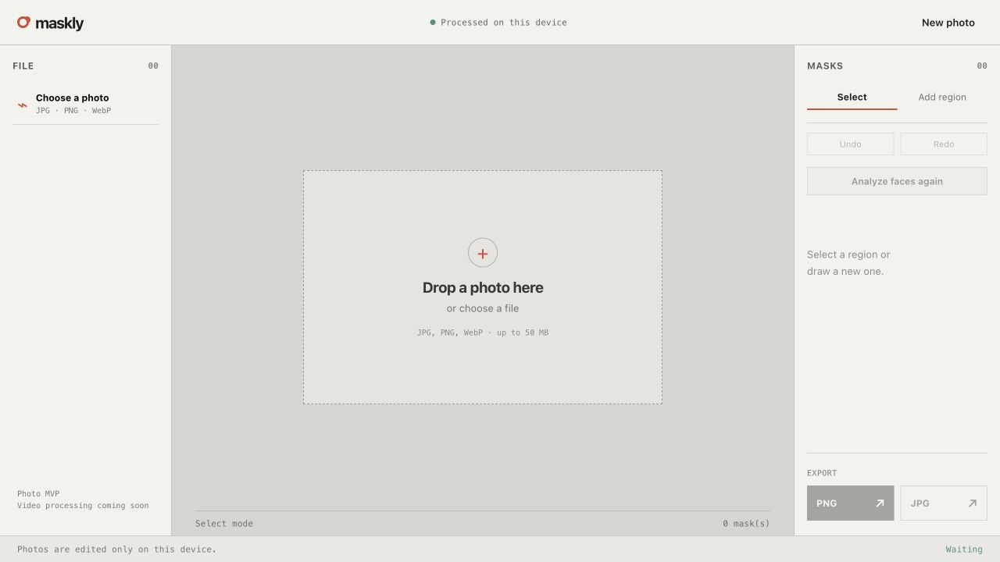

# FrameMute

FrameMute is a local-first photo privacy tool. It detects face candidates in a photo, lets you review or draw masking regions, and exports a mosaic-masked image without uploading the original photo to a FrameMute server.

> **Status:** early preview. Review every mask before sharing an exported image.



## What it does

- Runs as a desktop application and a static web experience.
- Accepts JPG, PNG, and WebP photos up to 50 MB.
- Detects face candidates locally with MediaPipe Tasks Vision.
- Lets you add, select, move, resize, and delete mask regions.
- Provides undo and redo with `Cmd/Ctrl+Z` and `Cmd/Ctrl+Shift+Z`.
- Previews and exports mosaic masking as PNG or JPG.

## Privacy model

FrameMute has no application backend and does not send selected photos or face-detection results to a FrameMute service. The original image is read in the current browser or desktop-app process, and the exported file is created locally.

The PWA may request its own static application assets, model, and WASM files from the host that serves FrameMute. These requests do not contain the selected photo. See [the privacy notes](docs/privacy.md) for the precise boundary and limitations.

## Quick start

### Web/PWA

```sh
npm install
npm run dev:web
```

Open the local URL printed by Vite, choose a photo, review the suggested regions, and export the result.

### Desktop application

```sh
npm install
npm run tauri:desktop -- dev
```

The desktop app currently targets macOS Apple Silicon for local packaging. The bundle is written to `apps/desktop/src-tauri/target/release/bundle/macos/FrameMute.app` after:

```sh
npm run tauri:desktop -- build --bundles app
```

## How masking works

1. The selected file is loaded from the local device into the active app process.
2. A local, overlapping scan pyramid searches at scales derived from the image resolution, without a fixed person-count limit.
3. MediaPipe Face Landmarker validates and tightens each candidate to reduce hand and background false positives.
4. FrameMute adds conservative padding around each candidate. You review, adjust, remove, or add regions manually.
5. Canvas renders a pixel mosaic only inside the selected regions.
6. Export encodes the edited canvas into a new PNG or JPG file on the local device.

Automatic detection is an aid, not a guarantee. It may miss faces or identify unsuitable regions; manual review is required for any privacy-sensitive use.

See the [synthetic multi-face validation](docs/multi-face-validation.md) for a ten-face regression example.

## Multi-face example

The following comparison uses an AI-generated image of fictional adults, not a
real-person photo. Automatic detection created ten mosaic regions locally; each
result still requires review before export.

| Original (AI-generated) | Masked locally in FrameMute |
| --- | --- |
|  |  |

## Architecture

```text
apps/web      ─┐
               ├─ @framemute/editor ─ @framemute/domain
apps/desktop  ─┘        │
                         └─ @framemute/vision-web (local MediaPipe model + WASM)
```

- `apps/web`: Vite web entry point, legacy cache cleanup, CSP, and hosting configuration.
- `apps/desktop`: Tauri shell that uses the same editor.
- `packages/domain`: normalized region geometry and masking rules.
- `packages/editor`: shared React editor and Canvas renderer.
- `packages/vision-web`: adaptive local MediaPipe face detection and landmark validation.

Read the fuller [architecture overview](docs/architecture.md).

## Development and verification

```sh
npm run test
npm run build:web
npm run build:desktop
npm run verify
```

`verify` also checks Rust formatting and tests for the desktop shell. GitHub Actions runs the TypeScript tests and both web and desktop front-end builds for every pull request and push to `main`.

## Roadmap and non-goals

The current preview is photo-only. Video processing, batch workflows, FFmpeg export, cloud synchronization, accounts, and server-side image analysis are not implemented.

## Contributing, security, and license

- Read [CONTRIBUTING.md](CONTRIBUTING.md) before opening a change.
- Report security issues using [SECURITY.md](SECURITY.md); do not include private photos or credentials in an issue.
- FrameMute source code is available under the [MIT License](LICENSE).
- Third-party notices, including MediaPipe Tasks Vision, are in [NOTICE](NOTICE).
