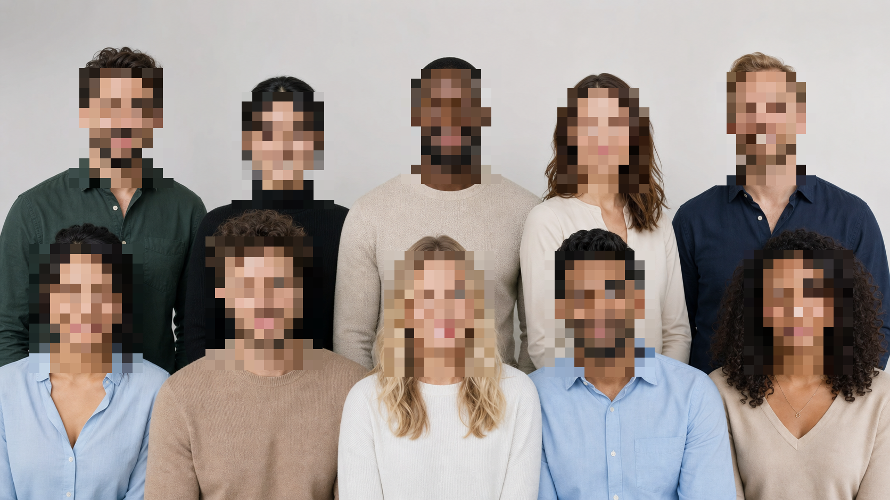

# Multi-face detection validation

This regression check uses an AI-generated group portrait with ten fictional
adults. It contains no real-person photo or personal data.

## Input

## Expected result

The local web app should create one automatic mosaic region for each of the ten
faces. The detector runs locally over overlapping image tiles, deduplicates
overlapping candidates, and returns at most ten candidates.

## Verified result

The status message reports `Found 10 face candidate(s). Please review all
results.` Users should still review every automatic mask before exporting.
